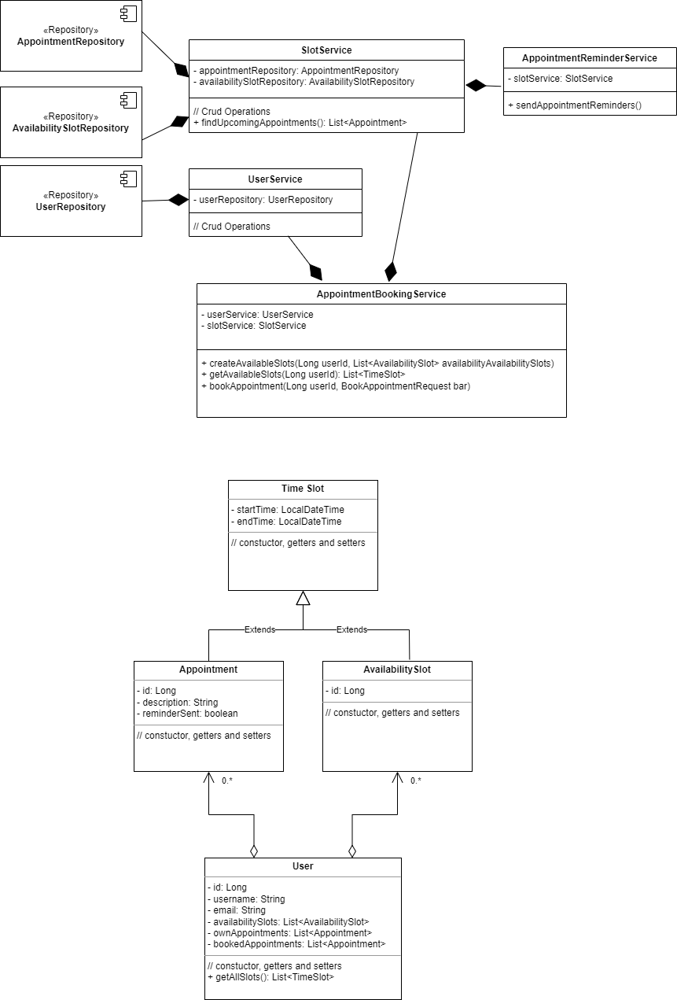

# Answers

## A - The entities
### UML Class Diagram

## B - Manage The Data
Entity classes implemented and associated with repository classes.

## C - Expose data with a RESTFUL API
Controller and Service classes implemented.

## D - Scheduled Task
AppointmentReminderService implemented to remind appointments.

## E - Improvements
- Could be added more validations like startTime cannot be after endTime.
- SlotService could have been more segregated.
- Models and schemas could be separated.
- Response and request model could be structured and standardized.
- Could be more detailed exceptions.
